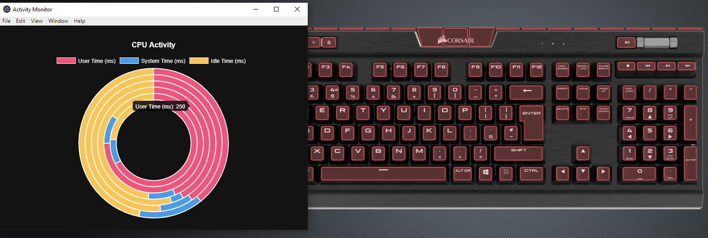

# Activity Monitor

Simple [Electron](http://electron.atom.io) application that shows a
doughnut chart of the CPU system, user, and idle activity time.

App uses [cue-sdk](https://www.npmjs.com/package/cue-sdk) to change keyboard color according to CPU usage

Original app: https://github.com/electron/simple-samples/tree/master/activity-monitor

## Getting started

- clone this repository
- `cd activity-monitor`
- `yarn` to install the application's dependencies
- `yarn start` to start the application
